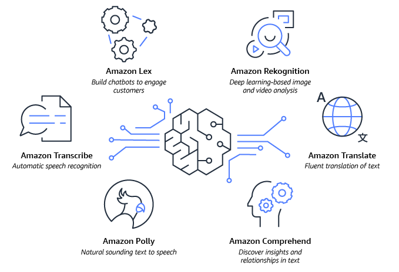
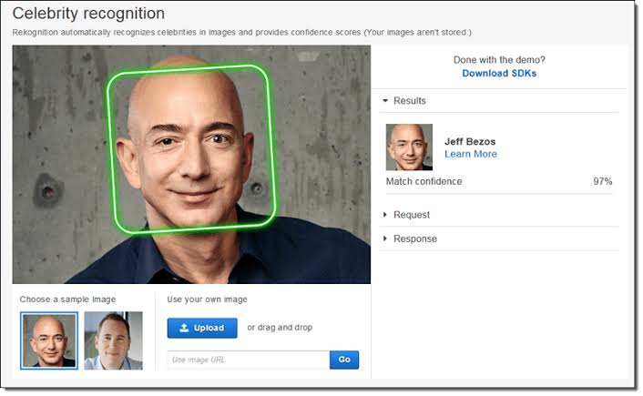
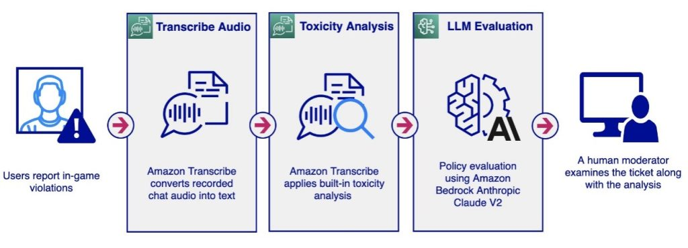
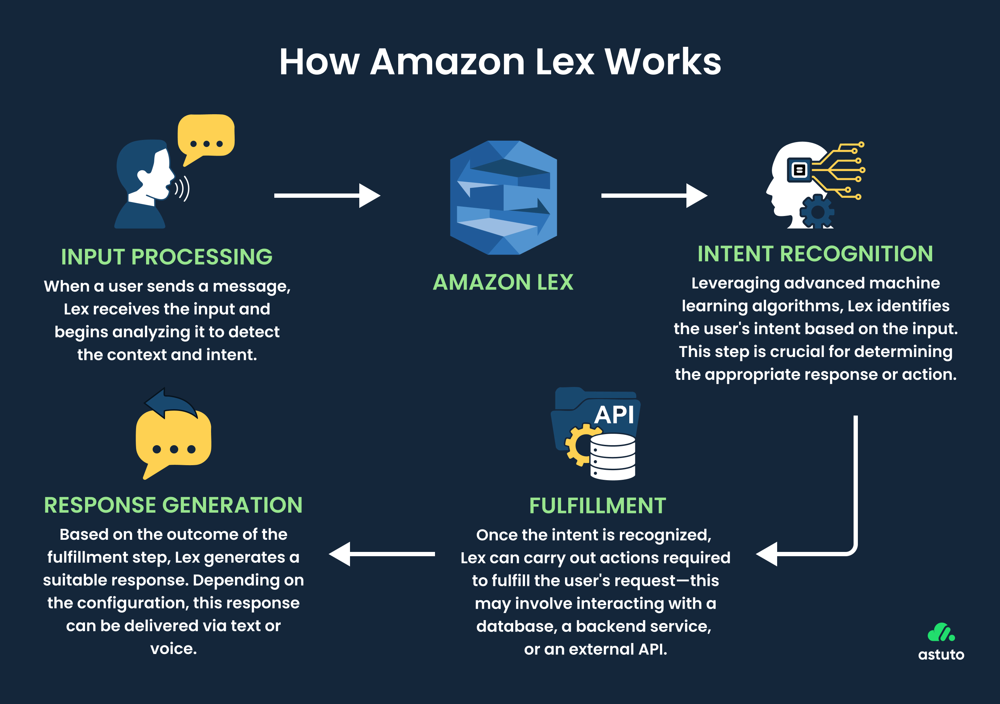
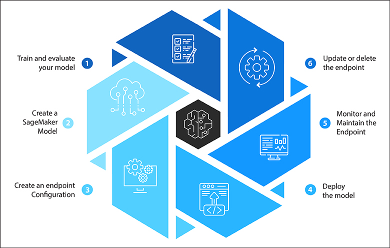

# 🤖 AWS Machine Learning Services — Complete Reference Guide

<div align="center">


### ⚡ AI/ML Managed Services Engineering Blueprint

*A deep-dive technical reference covering AWS managed AI services: computer vision, speech, NLP, translation, personalization, document extraction, search, and full ML model lifecycle management.*

</div>

---

## 📖 Overview

AWS offers a rich suite of fully managed, serverless AI/ML services that allow you to integrate intelligence into your applications without building or training models yourself. This guide covers each service's architecture, mechanics, real-world use cases, and exam traps for the SAA-C03 certification.



---

## 🔍 1. Amazon Rekognition

Amazon Rekognition is a fully managed **Computer Vision** service that analyzes images and videos using pre-trained deep learning models.

```
[ Image / Video Input ]
         │
         ▼
[ Amazon Rekognition Engine ]
         │
   ┌─────┴──────────────────────────────────┐
   ▼                                        ▼
[ Object & Scene Detection ]        [ Facial Analysis ]
  - Labels (car, dog, beach)          - Age range, gender, emotion
  - Text in image (OCR)               - Face comparison & verification
  - Activity detection                - Celebrity recognition
  - Unsafe content flags              - People counting
```


### Core Capabilities

* **Object & Scene Labeling:** Automatically tags images with descriptive labels (e.g., "Beach", "Sports Car", "Crowd").
* **Facial Analysis:** Detects facial attributes — estimated age range, gender expression, emotional state (happy, sad, surprised), and whether the person is wearing glasses or a hat.
* **Face Search & Verification:** Compares a detected face against a stored database of known faces for identity verification workflows.
* **Celebrity Recognition:** Identifies well-known public figures in media content.


* **Text Detection (OCR):** Reads printed or handwritten text embedded in images, such as license plates or signs.
* **Pathing:** Tracks the movement path of people in videos — useful for sports analytics (tracking player routes across a field).
* **Content Moderation:** Detects inappropriate or offensive content using confidence thresholds.

### 🏗️ Real-World Example — Employee Badge Verification System

```
[ Security Camera (RTSP Stream) ]
           │
           ▼
[ Kinesis Video Streams ]
           │ stream frames
           ▼
[ Amazon Rekognition Video ]
           │ detect & compare face
           ▼
[ Company Face Database (S3) ]
           │
   ┌───────┴──────────┐
   ▼ MATCH            ▼ NO MATCH
[ Unlock Door API ]   [ Trigger SNS Alert → Security Team ]
```

**Scenario:** A corporate office streams live camera feeds to Kinesis Video Streams. Rekognition compares each detected face against the registered employee database stored in S3. On a match, it calls a door-unlock Lambda. On failure, it publishes an alert via SNS to the security team.

---

## 🛡️ 2. Amazon Rekognition — Content Moderation

Content Moderation is a specialized Rekognition workflow for detecting and filtering unsafe or unwanted content in user-generated media.

```
[ User Uploads Image/Video ]
            │
            ▼
[ Amazon Rekognition ]
            │
   ┌─────────────────────────┐
   ▼                         ▼
[ Confidence >= Threshold ]  [ Confidence < Threshold ]
   AUTO-FLAG & BLOCK         ROUTE TO MANUAL REVIEW
                                      │
                                      ▼
                       [ Amazon Augmented AI (A2I) ]
                          Human reviewer approves
                          or dismisses the flag
```

### Key Mechanics

* **Minimum Confidence Threshold:** You set a confidence percentage (e.g., 80%). Any content where Rekognition's confidence that it is inappropriate exceeds this value is automatically flagged or blocked.
* **Amazon Augmented AI (A2I) Integration:** Content that falls near the threshold boundary is routed to A2I for a human reviewer to make the final call — ensuring regulatory compliance without over-blocking legitimate content.

### 🏗️ Real-World Example — Social Media Platform

A social media platform allows users to upload photos. Every upload is passed to Rekognition with a confidence threshold of 85%. If Rekognition detects nudity or graphic violence with ≥85% confidence, the image is auto-rejected. If confidence is between 70–84%, it goes to a human moderation queue via A2I. Below 70%, the image is published normally.

---

## 🎙️ 3. Amazon Transcribe

Amazon Transcribe is a fully managed **Automatic Speech Recognition (ASR)** service that converts spoken audio into written text.

```
[ Audio File (MP3 / WAV / FLAC) ]
   OR [ Real-Time Microphone Stream ]
                │
                ▼
    [ Amazon Transcribe ASR Engine ]
         (Deep Learning Neural Net)
                │
                ▼
    [ Output: Timestamped Text Transcript ]
         + [ PII Redaction Layer ]
         + [ Language Detection ]
```



### Core Features

* **Automatic PII Redaction:** Strips sensitive data (names, SSNs, credit card numbers, phone numbers) from transcripts before they are stored or processed.
* **Multi-Language Audio:** Automatically identifies the spoken language in a multi-lingual recording without manual configuration.
* **Custom Vocabulary:** You can provide domain-specific terms (medical jargon, product names) to improve transcription accuracy.

### 🏗️ Real-World Example — Contact Center Analytics Pipeline

```
[ Customer Support Call Recordings (S3) ]
                │
                ▼
    [ Amazon Transcribe Batch Job ]
         (PII Redaction enabled)
                │
                ▼
    [ Transcript Text Files (S3) ]
                │
                ▼
    [ Amazon Comprehend ]
         Sentiment Analysis
                │
          ┌─────┴──────┐
          ▼            ▼
   [ Positive ]   [ Negative ]
   Archive        Alert Manager
                  + Escalation Queue
```

**Scenario:** A telecom company runs nightly Transcribe batch jobs against their call recordings S3 bucket. PII redaction ensures compliance. The resulting transcripts are fed into Comprehend to detect call sentiment — negative calls trigger a manager review workflow.

---

## 🗣️ 4. Amazon Polly

Amazon Polly is a fully managed **Text-to-Speech (TTS)** service that converts written text into natural, lifelike spoken audio using deep learning.

```
[ Input Text / SSML Document ]
              │
              ▼
   [ Amazon Polly TTS Engine ]
       ├── Standard Voices
       └── Neural Voices (more human-like)
              │
              ▼
   [ Audio Stream Output (MP3 / OGG / PCM) ]
```

### Pronunciation Customization

* **Pronunciation Lexicons:** Define custom phonetic rules for specific words.
  * Example: "AWS" → spoken as "Amazon Web Services"
  * Example: "St3ph4ne" → spoken as "Stephane"
* **SSML (Speech Synthesis Markup Language):** Fine-grained control over how text is spoken:
  * `<emphasis>` — emphasize a word
  * `<break>` — insert a pause
  * `<prosody rate="slow">` — adjust speaking speed
  * `<amazon:breath>` — add breathing sounds for realism
  * `<amazon:effect name="whispered">` — whisper effect

### 🏗️ Real-World Example — Accessibility Audio Content Platform

```
[ Blog Articles stored in DynamoDB ]
                │
                ▼
   [ Lambda trigger on new article ]
                │
                ▼
   [ Amazon Polly: SynthesizeSpeech API ]
       Custom Lexicon: technical terms
       SSML: slow rate for headings
                │
                ▼
   [ MP3 Output saved to S3 ]
                │
                ▼
   [ CloudFront CDN → End User ]
   (Audio player on article page)
```

**Scenario:** A tech blog automatically generates audio versions of every new article using Polly. A Lambda function triggers on DynamoDB inserts, calls the SynthesizeSpeech API with an SSML-marked version of the article (slower pace at headings, emphasis on key terms), and saves the MP3 to S3 for delivery via CloudFront.

---

## 🌍 5. Amazon Translate

Amazon Translate is a fully managed **Neural Machine Translation** service delivering accurate, natural-sounding translations at scale.

```
[ Source Text (any language) ]
             │
             ▼
[ Amazon Translate Engine ]
    (Neural Machine Translation)
             │
    ┌────────┼────────┐
    ▼        ▼        ▼
 French   Portuguese  Hindi
 (fr)       (pt)      (hi)
```

### Core Features

* **Language Auto-Detection:** No need to specify the source language — Translate identifies it automatically.
* **Batch Translation:** Process large volumes of documents stored in S3 in a single batch job.
* **Custom Terminology:** Provide a glossary of brand-specific or domain-specific terms that must not be altered in translation (e.g., product names, medical terminology).

### 🏗️ Real-World Example — Global E-Commerce Product Catalog

```
[ Product Listings in English (S3) ]
                │
                ▼
[ Amazon Translate Batch Job ]
    Custom Terminology:
      "SuperCharge Pro" → kept as-is
                │
    ┌───────────┼──────────────┐
    ▼           ▼              ▼
 Spanish     German         Japanese
 S3 folder  S3 folder      S3 folder
                │
                ▼
[ CloudFront serves localized
  product pages by Accept-Language header ]
```

**Scenario:** An e-commerce platform stores all product descriptions in English in S3. A nightly batch Translate job generates localized versions in 10 languages, with a custom terminology file ensuring product brand names are never translated. CloudFront serves the appropriate version based on the user's browser language.

---

## 🤖 6. Amazon Lex & Amazon Connect

### Amazon Lex

Amazon Lex provides **Conversational AI** — the same core technology powering Amazon Alexa — enabling you to build intelligent chatbots and voice bots.

```
[ User Input: Voice or Text ]
           │
           ▼
[ Amazon Lex ]
   ├── ASR: Converts speech to text
   └── NLU: Understands intent & slots
           │
    ┌──────┴──────┐
    ▼             ▼
[ Intent A ]  [ Intent B ]
"BookFlight"  "CheckStatus"
    │
    ▼
[ Lambda Fulfillment Function ]
    │
    ▼
[ Airline Booking API ]
```



* **Intents:** The user's goal (e.g., "I want to book a flight").
* **Slots:** The parameters needed to fulfill the intent (departure city, destination, date).
* **Fulfillment:** A Lambda function that executes the business logic once all slots are filled.

### Amazon Connect

Amazon Connect is a **Cloud-Based Contact Center** platform that integrates with Lex for intelligent call routing.

```
[ Incoming Customer Phone Call ]
           │
           ▼
[ Amazon Connect ]
     Receives call
           │ streams audio
           ▼
[ Amazon Lex Bot ]
  "How can I help you today?"
  Recognizes intent: "Billing Issue"
           │
    ┌──────┴──────────────────┐
    ▼                         ▼
[ Self-Service Flow ]    [ Route to Human Agent ]
  Bot resolves issue      with full context
```

| Feature | Amazon Lex | Amazon Connect |
|---|---|---|
| **Primary Role** | Build conversational bots | Cloud contact center platform |
| **Interfaces** | Text & Voice | Phone calls & web |
| **Integration** | Lambda, DynamoDB, APIs | Lex bots, CRM systems |
| **Cost Model** | Per request | Per minute of usage |

### 🏗️ Real-World Example — Bank Customer Service Bot

**Scenario:** A bank's contact center uses Amazon Connect to receive calls. The audio stream is sent to a Lex bot that identifies the intent ("Check Account Balance", "Report Lost Card"). For balance checks, Lex calls a Lambda that queries DynamoDB and reads the result back to the customer. For complex issues, Connect routes to a human agent, passing the bot's conversation transcript for context — eliminating the need to repeat information.

---

## 📝 7. Amazon Comprehend

Amazon Comprehend is a fully managed, serverless **Natural Language Processing (NLP)** service that extracts meaning and insights from unstructured text.

```
[ Input Text Document ]
         │
         ▼
[ Amazon Comprehend NLP Engine ]
         │
   ┌─────┼─────────────────────────────┐
   ▼     ▼     ▼     ▼     ▼           ▼
[Lang] [Entities] [Phrases] [Sentiment] [Topics] [Syntax]
  EN    "AWS"       "deep    POSITIVE   "Cloud   Noun/Verb
        "Cairo"    learning"            Computing" tagging
```

### Analytical Capabilities

* **Entity Detection:** Identifies people, places, organizations, dates, quantities, and events.
* **Sentiment Analysis:** Classifies text as Positive, Negative, Neutral, or Mixed.
* **Key Phrase Extraction:** Surfaces the most important phrases in a document.
* **Language Detection:** Identifies the language of the input text.
* **Topic Modeling:** Groups a collection of documents by discovered topics — no predefined categories needed.
* **Syntax Analysis:** Tokenizes text and tags each token with its grammatical role (noun, verb, adjective).

### 🏗️ Real-World Example — Product Review Intelligence Dashboard

```
[ Customer Reviews (DynamoDB Streams) ]
                │ new review event
                ▼
   [ Lambda → Comprehend API ]
       Sentiment + Entity Detection
                │
        ┌───────┴────────┐
        ▼                ▼
[ Sentiment: NEGATIVE ]  [ Sentiment: POSITIVE ]
  Entity: "Battery"        Archive for reporting
        │
        ▼
[ SNS → Product Team Alert ]
  "Recurring battery complaints"
        │
        ▼
[ QuickSight Dashboard update ]
```

**Scenario:** An electronics retailer runs Comprehend against every new product review via DynamoDB Streams. Negative reviews with entity mentions of specific product components (battery, screen, charging) auto-alert the relevant product team via SNS and update a QuickSight insights dashboard.

---

## 🏥 8. Amazon Comprehend Medical

Amazon Comprehend Medical extends Comprehend's NLP capabilities specifically to **unstructured clinical text**, detecting medical entities and protected health information (PHI).

```
[ Clinical Notes / Discharge Summaries / Lab Results ]
                        │
                        ▼
        [ Amazon Comprehend Medical ]
                        │
           ┌────────────┼──────────────┐
           ▼            ▼              ▼
    [ Medical         [ PHI           [ Relationships ]
      Entities ]        Detection ]     (Drug → Dosage)
      Diagnoses         Name, DOB,      "Metformin
      Medications        Address         500mg twice
      Procedures         Phone           daily"
```

### Key APIs

* **DetectEntitiesV2:** Identifies medical conditions, medications, dosages, test names, and procedures.
* **DetectPHI:** Specifically extracts Protected Health Information for HIPAA compliance workflows.
* **InferICD10CM / InferRxNorm:** Maps detected conditions and medications to standard medical coding systems.

### 🏗️ Real-World Example — Hospital Records Digitization Pipeline

```
[ Doctor's Handwritten Notes (scanned) ]
                │
                ▼
[ Amazon Textract ]
  Converts handwriting to text
                │
                ▼
[ Amazon Transcribe Medical ]
  Patient audio narratives → text
                │
                ▼
[ Amazon Comprehend Medical ]
   DetectPHI → redact patient IDs
   DetectEntitiesV2 → extract diagnoses
                │
                ▼
[ EHR System (Electronic Health Records) ]
   Structured, coded medical data
```

**Scenario:** A hospital digitization project processes scanned physician notes through Textract (OCR), then Comprehend Medical to detect all PHI for redaction and extract diagnoses/medications for structured storage in the EHR system — fully automated and HIPAA-compliant.

---

## 🧠 9. Amazon SageMaker AI

Amazon SageMaker is a fully managed, end-to-end platform for building, training, and deploying custom **Machine Learning models** at any scale.

```
[ Raw Data ]
     │
     ▼ Label & Prepare
[ SageMaker Ground Truth ]
     │
     ▼ Explore & Visualize
[ SageMaker Studio (Jupyter) ]
     │
     ▼ Train & Tune
[ SageMaker Training Jobs ]
  Auto-provisions ML compute clusters
  Distributed training across GPU fleets
     │
     ▼ Evaluate
[ SageMaker Experiments ]
  Compare model versions & metrics
     │
     ▼ Deploy
[ SageMaker Endpoints ]
  Real-time inference API (auto-scaling)
  OR
[ SageMaker Batch Transform ]
  Offline bulk prediction jobs
```



### Why SageMaker?

Without SageMaker, an ML engineer must manually provision training servers, configure GPU drivers, manage distributed training, handle model versioning, and set up a serving infrastructure — each a complex engineering task. SageMaker abstracts all of this.

### SageMaker Key Components

| Component | Role |
|---|---|
| **SageMaker Studio** | Integrated IDE for the full ML lifecycle |
| **Ground Truth** | Human-labeling service for training data |
| **Training Jobs** | Managed, auto-scaled training compute |
| **Hyperparameter Tuner** | Automatic hyperparameter optimization |
| **Model Registry** | Version control and approval workflows for models |
| **Endpoints** | Real-time, auto-scaling inference APIs |
| **Pipelines** | CI/CD for ML workflows |

### 🏗️ Real-World Example — Exam Score Prediction Model

```
[ Historical Student Data (CSV in S3) ]
  study_hours | practice_tests | score
      10       |      3         |  670
      18       |      7         |  890
      22       |      9         |  934
                │
                ▼
[ SageMaker Ground Truth ]
  Label: "PASS" (>=720) / "FAIL" (<720)
                │
                ▼
[ SageMaker Training Job ]
  Algorithm: XGBoost (built-in)
  Instance: ml.m5.xlarge
  Hyperparameter Tuning: enabled
                │
                ▼
[ Best Model Artifact → S3 ]
                │
                ▼
[ SageMaker Endpoint ]
  Auto-scales: 1–10 instances
                │
                ▼
[ Student App → POST /predict ]
  { study_hours: 20, practice_tests: 8 }
  → Response: { prediction: "PASS", score_estimate: 906 }
```

---

## 🔎 10. Amazon Kendra

Amazon Kendra is a fully managed **Intelligent Enterprise Search** service powered by ML, enabling natural language queries across diverse document repositories.

```
[ Document Sources ]
   ├── Amazon S3
   ├── Amazon RDS
   ├── Google Drive
   ├── MS SharePoint
   ├── Salesforce
   ├── ServiceNow
   └── MS OneDrive
            │
            ▼ Connector ingests & indexes
[ Amazon Kendra Knowledge Index ]
   ML-powered semantic understanding
            │
            ▼
[ User Query: "Where is the IT support desk?" ]
            │
            ▼
[ Kendra Returns: "1st floor, Building A" ]
   (extracted directly from a PDF policy doc)
```

### Key Differentiators vs. Keyword Search

* **Semantic Understanding:** Kendra understands the *meaning* of a question, not just matching keywords. It returns direct answers extracted from documents, not just links.
* **Incremental Learning:** Kendra learns from user interactions — if users consistently click Result B over Result A for the same query, it promotes B automatically.
* **Manual Fine-Tuning:** Administrators can boost specific results (e.g., always surface the official HR policy document first for HR-related queries) or adjust result freshness weighting.

### 🏗️ Real-World Example — Enterprise IT Knowledge Base

**Scenario:** A company has thousands of internal documents scattered across SharePoint, S3, and Confluence. Instead of emailing IT for every question, employees use a Kendra-powered search portal. An employee types "How do I reset my VPN certificate?" — Kendra extracts the exact procedure from a SharePoint Word document and displays the step-by-step answer directly, without requiring the user to open or search through the document manually.

---

## 🎯 11. Amazon Personalize

Amazon Personalize is a fully managed ML service that delivers **real-time personalized recommendations** — the same technology powering Amazon.com's product recommendation engine.

```
[ User Behavioral Data ]
   - Purchase history
   - Click events
   - Search history
   - Ratings
         │
         ▼
[ Amazon S3 (training data) ]
         │
         ▼
[ Amazon Personalize ]
   Trains recommendation model automatically
   No ML expertise required
         │
         ▼ Real-time API
[ Personalize Campaign Endpoint ]
         │
   ┌─────┼───────────────┐
   ▼     ▼               ▼
[Web]  [Mobile App]   [Email/SMS Marketing]
   Personalized product grid per user
```

### Recommendation Types

* **User Personalization:** "What should this specific user see next?"
* **Related Items:** "Customers who viewed this also viewed..."
* **Re-ranking:** Reorder an existing list of items by predicted relevance to the current user.
* **User Segmentation:** Group users by predicted affinity for use in targeted marketing campaigns.

### 🏗️ Real-World Example — Gardening E-Commerce Platform

```
[ User: Ahmed ]
  Past purchases: Shovel, Potting Soil, Watering Can
                │
                ▼
[ Real-time event: Ahmed adds "Trowel" to cart ]
   Sent to Personalize via PutEvents API
                │
                ▼
[ Personalize Inference ]
  "Next best items for Ahmed"
                │
                ▼
[ Homepage widget updates in <100ms ]
  Recommendations: Fertilizer, Plant Stakes,
                   Gardening Gloves, Seed Starter Kit
```

**Scenario:** A gardening supply store integrates Personalize into their website via the PutEvents API to stream real-time clickstream data. Within days of go-live (not months), the homepage shows every user a personalized product grid — increasing click-through rates without any data science team involvement.

---

## 📄 12. Amazon Textract

Amazon Textract is a fully managed ML service that **automatically extracts text, handwriting, forms, and table data** from scanned documents — going far beyond simple OCR.

```
[ Scanned Document Input ]
   (PDF, JPG, PNG, TIFF)
         │
         ▼
[ Amazon Textract ML Engine ]
         │
   ┌─────┼─────────────────┐
   ▼     ▼                 ▼
[Raw  [Form Fields]    [Table Data]
 Text]  Key: "Name"     Row | Col
        Val: "Ahmed"    Data matrix
              │
              ▼
[ Structured JSON Output ]
  Machine-readable, no manual parsing
```

### Key Capabilities

* **Raw Text Extraction:** Reads printed and handwritten text from any document type.
* **Form Detection:** Identifies key-value pairs from forms (e.g., Patient Name: Ahmed, DOB: 01/01/1995).
* **Table Extraction:** Preserves the structure of tables in the extracted output as a data matrix.
* **ID Document Analysis:** Specialized API for extracting fields from driver's licenses, passports, and national ID cards.

### Use Cases by Industry

| Industry | Document Type | Textract Output |
|---|---|---|
| **Financial Services** | Invoices, bank statements | Extracted line items, totals, account numbers |
| **Healthcare** | Medical records, insurance claims | Patient data, diagnosis codes, coverage details |
| **Public Sector** | Tax forms, passports, IDs | Structured identity and compliance data |
| **Legal** | Contracts, court filings | Clause extraction, party identification |

### 🏗️ Real-World Example — Insurance Claims Automation

```
[ Customer submits claim PDF via app ]
                │
                ▼
[ S3 upload triggers Lambda ]
                │
                ▼
[ Amazon Textract: AnalyzeDocument API ]
   Extracts: Claim Number, Policy ID,
             Incident Date, Damage Amount
             Claimant Signature (handwritten)
                │
                ▼
[ Lambda parses JSON → validates fields ]
                │
        ┌───────┴────────┐
        ▼                ▼
[ Complete → Auto-approve ] [ Missing fields → SNS alert ]
  DynamoDB record created     to claims agent for review
```

**Scenario:** An insurance company eliminates manual data entry by routing submitted claim PDFs through Textract. The service extracts all form fields and table data automatically. A Lambda validates completeness — fully structured claims are approved within seconds; incomplete submissions trigger an SNS notification to a human agent.

---

## 📊 13. Complete Service Comparison Matrix

| Service | Category | Serverless | Custom Training | Primary Input | Primary Output |
|---|---|---|---|---|---|
| **Rekognition** | Computer Vision | ✅ | ❌ | Images / Video | Labels, faces, text |
| **Transcribe** | Speech → Text | ✅ | ❌ | Audio | Text transcript |
| **Polly** | Text → Speech | ✅ | ❌ | Text / SSML | Audio stream (MP3) |
| **Translate** | Language | ✅ | ❌ | Text | Translated text |
| **Lex** | Conversational AI | ✅ | ❌ | Voice / Text | Intent + response |
| **Connect** | Contact Center | ✅ | ❌ | Phone calls | Routed call flows |
| **Comprehend** | NLP | ✅ | ✅ (custom) | Text | Entities, sentiment, topics |
| **Comprehend Medical** | Medical NLP | ✅ | ❌ | Clinical text | PHI, medical entities |
| **SageMaker** | Full ML Platform | ❌ (managed) | ✅ (full control) | Any data | Custom ML model + endpoint |
| **Kendra** | Enterprise Search | ✅ | ❌ | Documents | Natural language answers |
| **Personalize** | Recommendations | ✅ | ❌ | User behavior | Ranked recommendations |
| **Textract** | Document AI | ✅ | ❌ | Scanned docs | Structured text/forms/tables |

---

## 🕳️ 14. AWS Certification Exam Traps & Scenario Analysis

### 🚨 Trap 1: Rekognition vs. Textract for OCR

* **Question Pattern:** A company needs to extract text from ID documents submitted as images.
* **Wrong Answer:** Use Amazon Rekognition Text Detection.
* **Correct Answer:** Use **Amazon Textract** with the AnalyzeID API.
* **Reasoning:** While Rekognition can detect text in images, Textract is purpose-built for structured document extraction — it understands form fields, key-value pairs, and document layout, making it far superior for ID and form processing.

### 🚨 Trap 2: Kendra vs. Comprehend for Document Search

* **Question Pattern:** A company wants employees to ask natural language questions and get direct answers from internal documents.
* **Wrong Answer:** Use Amazon Comprehend Topic Modeling on the document corpus.
* **Correct Answer:** Use **Amazon Kendra** with document connectors.
* **Reasoning:** Comprehend analyzes text for NLP insights (sentiment, entities). Kendra is specifically designed for question-answering and enterprise search — it extracts direct answers from documents.

### 🚨 Trap 3: Personalize vs. Comprehend for Recommendations

* **Question Pattern:** A streaming service wants to recommend movies to users based on viewing history.
* **Wrong Answer:** Use Amazon Comprehend to analyze movie descriptions and match to user preferences.
* **Correct Answer:** Use **Amazon Personalize** with user interaction data.
* **Reasoning:** Comprehend extracts NLP insights from text. Personalize is a full recommendation engine that trains on behavioral data (views, clicks, ratings) to generate ranked personalized item lists.

### 🚨 Trap 4: SageMaker vs. Managed Services

* **Question Pattern:** A startup wants to add sentiment analysis to their app with minimal ML expertise and the fastest time-to-market.
* **Wrong Answer:** Build a custom model using Amazon SageMaker with a training dataset.
* **Correct Answer:** Use **Amazon Comprehend** (managed, pre-trained sentiment analysis).
* **Reasoning:** SageMaker is for when you need a custom model with full control. Comprehend is a pre-built NLP service — zero training required, available immediately via API.

### 🚨 Trap 5: Transcribe vs. Lex for Voice Input

* **Question Pattern:** A company wants to build a voice-activated chatbot that understands customer intents.
* **Wrong Answer:** Use Amazon Transcribe to convert customer voice to text, then process the text with a custom algorithm.
* **Correct Answer:** Use **Amazon Lex**, which handles ASR + NLU in a single service.
* **Reasoning:** Transcribe is a raw speech-to-text converter — it has no concept of intents or conversational context. Lex combines ASR and Natural Language Understanding specifically for building conversational bots.

---

## ⚡ 15. High-Frequency Exam Facts

| Fact | Service |
|---|---|
| Powers Alexa | **Amazon Lex** |
| HIPAA-compliant PHI detection | **Comprehend Medical** |
| No ML expertise needed for recommendations | **Amazon Personalize** |
| Implement in days, not months | **Amazon Personalize** |
| Incremental learning from user feedback | **Amazon Kendra** |
| SSML for speech customization | **Amazon Polly** |
| A2I for human review of flagged content | **Rekognition Content Moderation** |
| Extracts key-value pairs from forms | **Amazon Textract** |
| Full ML lifecycle management | **Amazon SageMaker** |
| 80% cheaper than traditional contact centers | **Amazon Connect** |

---

## ✅ 16. Production Best Practices

* **Use Managed Services Before Building Custom:** If Comprehend, Rekognition, or Translate covers your use case, prefer them over SageMaker — they require zero training data and deploy in minutes.
* **Set Confidence Thresholds for Rekognition Moderation:** Never use a 100% threshold — some inappropriate content will always score below. Use A2I as a safety net for the threshold gap.
* **Enable PII Redaction in Transcribe Before Storage:** Never store raw call recordings transcripts without redaction if customer data is present — enable the PII redaction feature at the Transcribe job level.
* **Feed Personalize Real-Time Events via PutEvents API:** Don't wait for nightly batch updates. Stream clickstream data in real-time so recommendations adapt to session behavior instantly.
* **Use Textract for Forms, Not Just Rekognition OCR:** For any document with structure (forms, tables, IDs), always choose Textract — Rekognition text detection treats text as a flat list of detected strings with no structural understanding.
* **Use SageMaker Pipelines for ML CI/CD:** Treat ML model retraining like software deployments — version control your datasets, training scripts, and model artifacts using SageMaker Pipelines and Model Registry.
* **Store Kendra Source Documents in S3:** S3 is the most reliable, cost-effective origin for Kendra indexing. Use S3 versioning to ensure Kendra's Incremental Sync picks up document updates automatically.